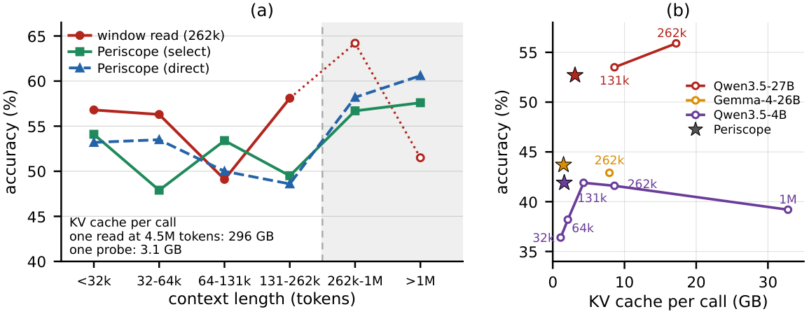
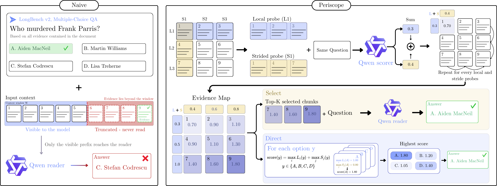
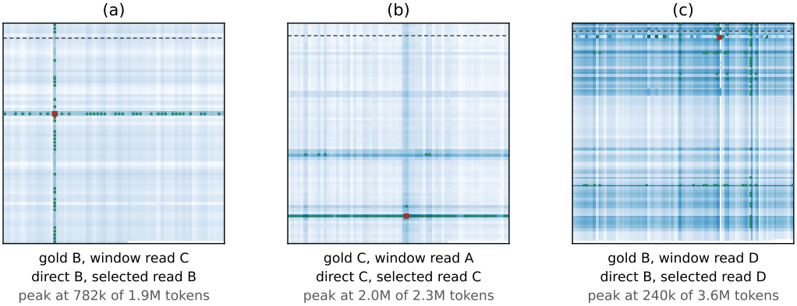

# Periscope: Extending Frozen Language Models Beyond Their Context Window
**Authors:** Mohamed Eltahir, Anas Obayd, Raed Rashid, Abdulrahman Alghamdi, Abdulrahman Mousa, Abdullah Mahmoud, Tanveer Hussain and Naeemullah Khan.

<div align="center">

[](https://arxiv.org/abs/XXXX.XXXXX)

</div>

<div align="center">
  
  <p><em>(a) Qwen3.5-27B on LongBench v2, accuracy by context length. Past its native 262k window the window read sees only a prefix, while Periscope keeps reading. (b) Accuracy against the peak key-value cache of one call: Periscope matches or approaches the best window read of each model with a third to a fifth of its cache.</em></p>
</div>

---

## Highlights
- **Factorized reading.** A long read is replaced by 2K short, independent probes of a frozen model over a K×K grid of chunks: K *local* spans of consecutive chunks and K *strided* spans that sample the whole text. A model served at a window of W tokens reads texts of up to W²/c tokens, for chunk size c.
- **The evidence map.** Each answer takes its best local and its best strided score, and scoring every chunk by its two spans gives a map of where the evidence sits, at no extra cost. Its peak is the chunk behind the answer.
- **One map, four readouts.** The same probes rank documents, answer directly with no further call, locate the evidence, or select K chunks for one short read.
- **The memory of one probe.** No call is longer than about √(sc) tokens, so the key-value cache never exceeds that of one probe, whatever the length of the text. A 27B model reads 4.5M-token contexts on one 80GB GPU, where a single read would need 296GB of cache.
- **Training-free and model-agnostic.** The same forward pass and one-token readout as an ordinary read, through any OpenAI-compatible server. Nothing is trained, nothing is generated, no state passes between calls.

---

## News
- [2026-10] arXiv preprint and code released.

---

## Method
<div align="center">
  
  <p><em>Left: the window read sees only the first chunks and misses the evidence in chunk 9. Right: the chunks sit on a K×K grid. Each local probe L<sub>i</sub> reads K consecutive chunks and each strided probe S<sub>j</sub> every K-th chunk, and each chunk scores the sum of its two probes. The map peaks at the evidence chunk, and the answer comes from reading the top K chunks (Select) or from each option's best local and strided scores alone (Direct).</em></p>
</div>

<div align="center">
  
  <p><em>Evidence maps of three long questions (Qwen3.5-27B). Each row of cells is one local span and each column one strided span. The outlined cell is the peak and the dots are the K selected chunks.</em></p>
</div>

---

# Guide

## Prerequisites
- Python **3.10+**
- One GPU for the served model. Every result in the paper runs on a single A100 80GB.
- [vLLM](https://github.com/vllm-project/vllm), or any server with an OpenAI-compatible `/v1/completions` endpoint that returns the top-20 log-probabilities.

## Installation

```bash
git clone https://github.com/mohammad2012191/Periscope.git
cd Periscope
pip install -r requirements.txt
python tests/test_core.py        # checks the grid, the composition rule and the map, no GPU needed
```

## Serve a model

Periscope talks to a running server, so every arm of an experiment shares the same model, memory and compute.

```bash
vllm serve Qwen/Qwen3.5-4B --max-model-len 131072 --max-num-seqs 32 --port 8000
```

`--max-model-len` is the window. Pass the same value as `--window` to Periscope, which uses it to skip any call that would not fit. Periscope never needs a long window: its longest probe is about √(sc) tokens, 48k at a 4.5M-token context with 500-token chunks.

---

## 1. Use Periscope on your own data

### Python

```python
from periscope import Periscope

p = Periscope("http://localhost:8000", "Qwen/Qwen3.5-4B", window=131072, chunk_size=500)

# Multiple-choice question over a long text (any number of options from 2 to 25)
out = p.answer(long_text, "Who murdered Frank Parris?",
               ["Aiden MacNeil", "Martin Williams", "Stefan Codrescu", "Lisa Treherne"])
out["select"]      # answer of the selected read: the K highest chunks of the map, read once
out["direct"]      # answer from the probes alone, no further call
out["selected"]    # indices of the chunks the map selected, in reading order
out["peak"]        # (i, j) cell of the map's peak = chunk i*K + j, the chunk behind the answer
out["scores"]      # composed score of every option, score(y) = max_i L_i(y) + max_j S_j(y)
out["map"]         # the full evidence map, {"i,j": score}

# Rank long documents by relevance to a query (ranking readout, no candidate pooling)
p = Periscope("http://localhost:8000", "Qwen/Qwen3-4B-Instruct-2507", window=16384, chunk_size=100)
scores = p.rank("how do plants respond to drought?", {"doc1": text1, "doc2": text2})
```

Pass `read=False` to `answer` for the direct readout alone, and `budget=` to read more or fewer than K chunks.
A second, larger model can perform the selected read while a small model builds the map:

```python
p = Periscope("http://localhost:8000", "Qwen/Qwen3.5-4B",
              read_server="http://localhost:8001", read_model="Qwen/Qwen3.5-27B")
```

### Command line

Questions, one JSON object per line:
```json
{"id": "q1", "text": "<the long text>", "question": "Who ...?", "options": ["...", "...", "...", "..."]}
```

```bash
python -m periscope qa --server http://localhost:8000 --model Qwen/Qwen3.5-4B \
    --window 131072 --input questions.jsonl --output answers.jsonl --save-map
```

Retrieval, a file of queries `{"id", "query"}` and a file of documents `{"id", "text"}`:

```bash
python -m periscope rank --server http://localhost:8000 --model Qwen/Qwen3-4B-Instruct-2507 \
    --window 16384 --queries queries.jsonl --docs docs.jsonl --output ranking.jsonl
```

Both commands resume from the output file if interrupted.

| Parameter | Description | Default |
|-----------|-------------|---------|
| `--window` | The server's `--max-model-len` | `131072` |
| `--chunk-size` | Tokens per chunk | `500` (qa), `100` (rank) |
| `--readout` | `both` (direct and select) or `direct` (no read after the probes) | `both` |
| `--budget` | Chunks in the selected read, `0` = K | `0` |
| `--read-server`, `--read-model` | A second model performs the selected read | none |
| `--preamble` | Instruction line placed before every prompt | none |
| `--save-map` | Keep the evidence map of every question | off |
| `--batch` | Prompts per request to the server | `64` |

**Choosing the chunk size.** Smaller chunks give a sharper map and more probes. 500 tokens works well for question answering over long contexts and 100 tokens for ranking documents of a few thousand tokens. The reach is W²/c, so a 32k window at c = 500 reads 2M tokens.

---

## 2. Reproduce the paper

Every script writes one resumable file per arm under `results/` and prints the numbers of the corresponding table.

### LongBench v2 (Table 1)

Serve the model at each window you want to evaluate, then run the arms against it. Periscope itself only needs the 131k server.

```bash
# Qwen3.5-4B at 131k: the window read and every K-chunk arm
vllm serve Qwen/Qwen3.5-4B --max-model-len 131072 --max-num-seqs 32 --port 8000
python scripts/run_qa.py --server http://localhost:8000 --model Qwen/Qwen3.5-4B --window 131072 \
    --arms window,periscope,first,random

# embedding selection: one more server for the embedder
vllm serve Qwen/Qwen3-Embedding-4B --task embed --port 8006
python scripts/run_qa.py --server http://localhost:8000 --model Qwen/Qwen3.5-4B --window 131072 \
    --arms embed --embed-server http://localhost:8006
```

The window read at the other windows: restart the server with `--max-model-len 32768`, `65536` or `262144` and run `--arms window --window <same value>`. The 1M window uses YaRN:

```bash
VLLM_ALLOW_LONG_MAX_MODEL_LEN=1 vllm serve Qwen/Qwen3.5-4B --max-model-len 1000000 --max-num-seqs 1 \
    --hf-overrides '{"text_config": {"rope_parameters": {"rope_type": "yarn", "factor": 4.0, "original_max_position_embeddings": 262144}}}'
python scripts/run_qa.py --server http://localhost:8000 --model Qwen/Qwen3.5-4B --window 1000000 --arms window
```

Qwen3.5-27B, the same commands with:

```bash
vllm serve Qwen/Qwen3.5-27B --max-model-len 131072 --max-num-seqs 8 --gpu-memory-utilization 0.95 --port 8000
python scripts/run_qa.py --server http://localhost:8000 --model Qwen/Qwen3.5-27B --window 131072 \
    --arms window,periscope,embed --embed-server http://localhost:8006
# the 262k window read: restart with --max-model-len 262144 --max-num-seqs 2
```

The 4B's map read by the 27B (both servers up, the 4B on 8000 and the 27B on 8001):

```bash
python scripts/run_qa.py --server http://localhost:8000 --model Qwen/Qwen3.5-4B --window 131072 \
    --read-server http://localhost:8001 --read-model Qwen/Qwen3.5-27B --arms periscope
```

Gemma-4-26B-A4B-it at its native 262k window:

```bash
vllm serve google/gemma-4-26b-a4b-it --max-model-len 262144 --max-num-seqs 8 --max-num-batched-tokens 8192 \
    --limit-mm-per-prompt '{"image":0,"video":0}' --gpu-memory-utilization 0.95 --port 8000
python scripts/run_qa.py --server http://localhost:8000 --model google/gemma-4-26b-a4b-it --window 262144 \
    --arms window,periscope
```

Add `--split short|medium|long` to run one split at a time, for example to spread the splits over several GPUs.

### InfiniteBench En.MC (Table 2)

```bash
vllm serve Qwen/Qwen3.5-4B --max-model-len 131072 --max-num-seqs 32 --port 8000
python scripts/run_qa.py --dataset infinitebench --server http://localhost:8000 --model Qwen/Qwen3.5-4B \
    --window 131072 --arms window,periscope,first,random
# the 262k window read: restart with --max-model-len 262144 and run --arms window --window 262144
```

### BRIGHT long-document retrieval (Table 3)

Full corpus, 50 queries in each of seven domains, every document scored against every query.

```bash
vllm serve Qwen/Qwen3-4B-Instruct-2507 --max-model-len 16384 --max-num-seqs 256 --port 8000
python scripts/run_retrieval.py --server http://localhost:8000 --model Qwen/Qwen3-4B-Instruct-2507 \
    --arms periscope,window,firstp

python scripts/baselines.py --method bm25
python scripts/baselines.py --method embed --model Qwen/Qwen3-Embedding-4B
python scripts/baselines.py --method embed-chunkmax --model Qwen/Qwen3-Embedding-4B
```

### Ablations (Table 4)

```bash
# what the strided probes add: local probes only
python scripts/run_qa.py --server http://localhost:8000 --model Qwen/Qwen3.5-4B --window 131072 --arms local
python scripts/run_retrieval.py --server http://localhost:8000 --model Qwen/Qwen3-4B-Instruct-2507 --arms local,maxp

# independent probes or a chain: Chain of Agents over the same K local spans
python scripts/run_qa.py --server http://localhost:8000 --model Qwen/Qwen3.5-4B --window 131072 --arms coa
```

### Arms

| Script | Arm | What it reads |
|--------|-----|---------------|
| `run_qa.py` | `window` | the longest prefix that fits the window, one call |
| | `periscope` | 2K probes, then the direct readout and one read of the K chunks the map ranks highest |
| | `first`, `random`, `embed` | one read of K chunks chosen without the map: first, random, most similar to the question |
| | `local` | the K local probes only, direct readout |
| | `coa` | Chain of Agents, sequential summaries over the K local spans |
| `run_retrieval.py` | `periscope` | ranking readout, local and strided probes |
| | `local`, `maxp` | local probes only, or one probe per chunk |
| | `window`, `firstp` | the longest prefix that fits the window, or the first chunk |
| `baselines.py` | `bm25`, `embed`, `embed-chunkmax` | BM25, one embedding per document, or the best-scoring chunk |

---

## Citation

If you use Periscope in your research, please cite:

```bibtex
@misc{eltahir2026periscope,
      title={Periscope: Extending Frozen Language Models Beyond Their Context Window},
      author={Mohamed Eltahir and Anas Obayd and Raed Rashid and Abdulrahman Alghamdi and Abdulrahman Mousa and Abdullah Mahmoud and Tanveer Hussain and Naeemullah Khan},
      year={2026},
      eprint={XXXX.XXXXX},
      archivePrefix={arXiv},
      primaryClass={cs.CL},
      url={https://arxiv.org/abs/XXXX.XXXXX},
}
```
